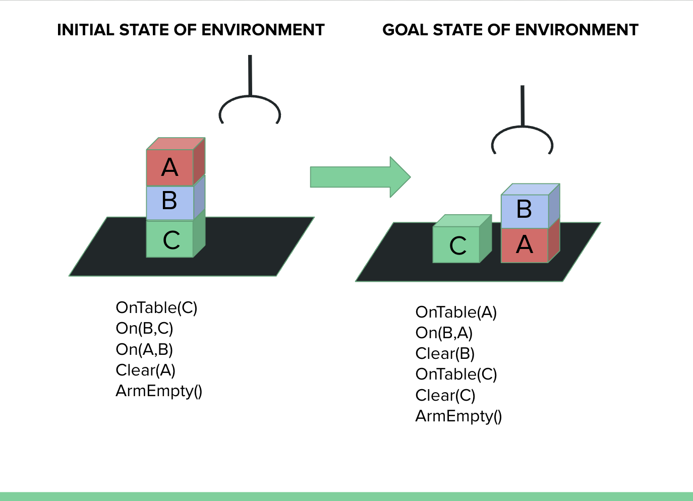

<!-- Improved compatibility of back to top link: See: https://github.com/othneildrew/Best-README-Template/pull/73 -->
<a name="readme-top"></a>
<!--
*** Thanks for checking out the Best-README-Template. If you have a suggestion
*** that would make this better, please fork the repo and create a pull request
*** or simply open an issue with the tag "enhancement".
*** Don't forget to give the project a star!
*** Thanks again! Now go create something AMAZING! :D
-->


<!-- PROJECT SHIELDS -->
<!--
*** I'm using markdown "reference style" links for readability.
*** Reference links are enclosed in brackets [ ] instead of parentheses ( ).
*** See the bottom of this document for the declaration of the reference variables
*** for contributors-url, forks-url, etc. This is an optional, concise syntax you may use.
*** https://www.markdownguide.org/basic-syntax/#reference-style-links
-->
[![Contributors][contributors-shield]][contributors-url]
[![Forks][forks-shield]][forks-url]
[![Stargazers][stars-shield]][stars-url]
[![Issues][issues-shield]][issues-url]
[![MIT License][license-shield]][license-url]


<!-- PROJECT LOGO -->
<br />
<div align="center">
  <a href="https://github.com/christina8711/llm_cubestacking">
    
  </a>

<h3 align="center">LLM Cube Stacking</h3>

  <p align="center">
Undergraduate Research Project: To assess the capabilities of LLM and VLM in cube stacking for common-sense planning challenges.
With the goal of generating optimized sequences of events to address cube-stacking challenges using openai

  <br />
    <a href="https://github.com/christina8711/llm_cubestacking"><strong>Explore the docs »</strong></a>
    <br />
    <br />
    <a href="https://github.com/christina8711/llm_cubestacking">View Demo</a>
    ·
    <a href="https://github.com/christina8711/llm_cubestacking/issues">Report Bug</a>
    ·
    <a href="https://github.com/christina8711/llm_cubestacking/issues">Request Feature</a>
  </p>
</div>


<!-- TABLE OF CONTENTS -->
<details>
  <summary>Table of Contents</summary>
  <ol>
    <li>
      <a href="#about-the-project">About The Project</a>
      <ul>
        <li><a href="#project-overview">Project Overview</a></li>
      </ul>
    </li>
    <li>
      <a href="#getting-started">Getting Started</a>
      <ul>
        <li><a href="#installation">Installation</a></li>
      </ul>
    </li>
    <li><a href="#roadmap">Roadmap</a></li>
    <li><a href="#contributing">Contributing</a></li>
    <li><a href="#license">License</a></li>
    <li><a href="#contact">Contact</a></li>
    <li><a href="#acknowledgments">Acknowledgments</a></li>
  </ol>
</details>


<!-- ABOUT THE PROJECT -->
## About The Project

[![Product Name Screen Shot][product-screenshot]](https://www.figma.com/proto/0GpjNvYnQ2UOFGzLp2EGzn/Virtual-NFT-Art-Exhibition-Website?type=design&node-id=24-510&t=iFTDOoxP4ii7dCeN-1&scaling=scale-down-width&page-id=0%3A1&starting-point-node-id=34%3A48&mode=design)

## Project Overview

At Shellhacks 2023, we're tackling the challenges posed by Google and Microsoft by creating a website that doubles as an educational platform for NFTs. Our platform also offers a virtual art exhibition where users can explore NFT art, dive into the world of featured crypto artists, and gain insights into the showcased artworks. Augmented Reality is incorporated for users with a mobile device, allowing them to visualize NFT art in their own space.


<!-- GETTING STARTED -->

### Getting Started

* npm
  ```sh
  npm install npm@latest -g
  ```

### Installation

1. **Clone the repo:**
   ```sh
   git clone https://github.com/christina8711/crypto_gallery.git
   ```
   - This step clones the repository from GitHub to your local machine.

2. **Navigate to the project directory:**
   ```sh
   cd crypto_gallery
   ```
   - Change your working directory to the newly cloned repository.

3. **Install Node.js and npm (if not already installed):**
   - Ensure that Node.js and npm are installed on your system. You can download them from the [official Node.js website](https://nodejs.org/).

4. **Install project-specific dependencies:**
   ```sh
   npm install
   ```
   - Use this command to install the project-specific Node.js packages and dependencies listed in the `package.json` file.


<p align="right">(<a href="#readme-top">back to top</a>)</p>


<!-- ROADMAP -->
## Roadmap

- [ ] Create a publicly accessible virtual reality (VR) platform that seamlessly integrates with opensea.com
- [ ] Create an interactive prototype that visually demonstrates our vision for the educational NFT art exhibition website
- [ ] Establish a GitHub repository with react setup
    - [ ] Code the frontend of the website
    - [ ] Code the backend of the website

See the [open issues](https://github.com/christina8711/crypto_gallery/issues) for a full list of proposed features (and known issues).

<p align="right">(<a href="#readme-top">back to top</a>)</p>


<!-- CONTRIBUTING -->
## Contributing

Contributions are what makes the open source community such an amazing place to learn, inspire, and create. Any contributions you make are **greatly appreciated**.

If you have a suggestion that would make this better, please fork the repo and create a pull request. You can also simply open an issue with the tag "enhancement".
Don't forget to give the project a star! Thanks again!

1. Fork the Project
2. Create your Feature Branch (`git checkout -b feature/AmazingFeature`)
3. Commit your Changes (`git commit -m 'Add some AmazingFeature'`)
4. Push to the Branch (`git push origin feature/AmazingFeature`)
5. Open a Pull Request

<p align="right">(<a href="#readme-top">back to top</a>)</p>


<!-- LICENSE -->
## License

Distributed under the MIT License. See `LICENSE.txt` for more information.

<p align="right">(<a href="#readme-top">back to top</a>)</p>


<!-- CONTACT -->
## Contact

Christina Nguyen - [![LinkedIn][linkedin-shield]][1linkedin-url] - ch487674@ucf.edu

Peter Nguyen - [![LinkedIn][linkedin-shield]][2linkedin-url] - pe264311@ucf.edu

Tran Pham - [![LinkedIn][linkedin-shield]][3linkedin-url] - Tran.pham2@ucf.edu

Project Link: [https://github.com/christina8711/crypto_gallery](https://github.com/christina8711/crypto_gallery)

<p align="right">(<a href="#readme-top">back to top</a>)</p>


<!-- ACKNOWLEDGMENTS -->
## Acknowledgments

We would like to extend our gratitude to the following:

- **Florida International University (FIU) and INIT:** We appreciate FIU and INIT for hosting ShellHacks Hackathon, which provided us with an incredible opportunity this weekend.

- **Our Dedicated Team:** A big shoutout to our hardworking team for putting in tireless efforts all weekend to achieve our goals.

- **Figma and Art Placer:** We want to acknowledge the invaluable role that Figma and Art Placer played in the development of our prototype, enabling us to bring our vision to life.

- **OpenSea:** Special thanks to OpenSea for offering an exceptional learning section. It allowed us to reference and gain a deeper understanding of NFTs, contributing significantly to our project's success.


<p align="right">(<a href="#readme-top">back to top</a>)</p>


<!-- MARKDOWN LINKS & IMAGES -->
<!-- https://www.markdownguide.org/basic-syntax/#reference-style-links -->
[contributors-shield]: https://img.shields.io/github/contributors/christina8711/llm_cubestacking.svg?style=for-the-badge
[contributors-url]: https://github.com/christina8711/LLM_CubeStacking/graphs/contributors
[forks-shield]: https://img.shields.io/github/forks/christina8711/llm_cubestacking.svg?style=for-the-badge
[forks-url]: https://github.com/christina8711/llm_cubestacking/network/members
[stars-shield]: https://img.shields.io/github/stars/christina8711/llm_cubestacking.svg?style=for-the-badge
[stars-url]: https://github.com/christina8711/llm_cubestacking/stargazers
[issues-shield]: https://img.shields.io/github/issues/christina8711/llm_cubestacking.svg?style=for-the-badge
[issues-url]: https://github.com/christina8711/llm_cubestacking/issues
[license-shield]: https://img.shields.io/github/license/christina8711/llm_cubestacking.svg?style=for-the-badge
[license-url]: https://github.com/christina8711/llm_cubestacking/blob/master/LICENSE.txt
[product-screenshot]: images/WebSS.png
[linkedin-shield]:https://img.shields.io/badge/Linkedin-blue?style=flat&logo=linkedin&ilabelColor=blue
[1linkedin-url]: https://www.linkedin.com/in/christinanguyen8711/
[2linkedin-url]: https://www.linkedin.com/in/peterh-nguyen/
[3linkedin-url]: https://www.linkedin.com/in/tranpham9/
